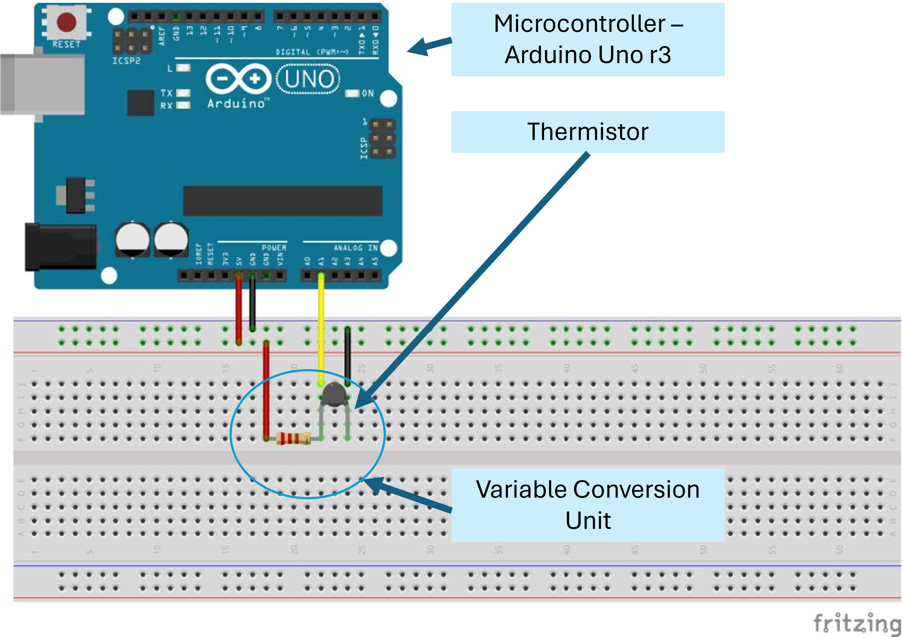
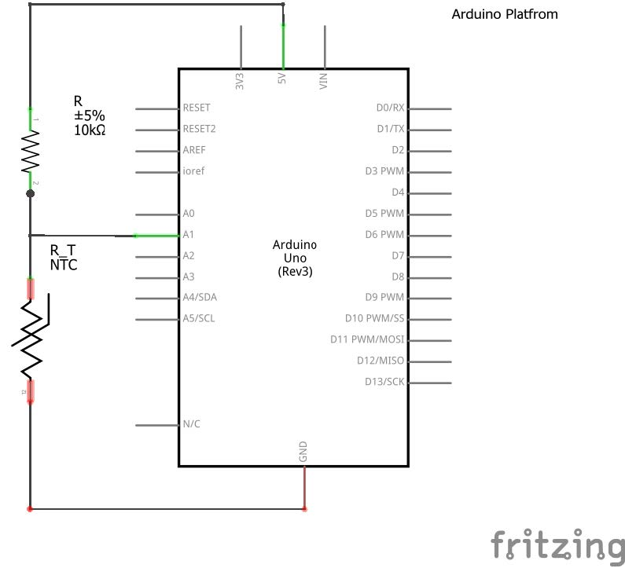

# AERO 3320 System Dynamics

Author: Stephen Thiam-Choy Kwok-Choon

# Lab 1 Sensor Characterization and Calibration

## 1. Objectives

<!-- justify text - <div style="text-align: justify"> your-text-here </div>     -->

<div style="text-align: justify"> Students will pick a thermistor and build hardware and software systems to take data. The students will be required to discuss sources of error, quantify errors and calibrate sensors. This lab will cover the following topics: </div>

- Sensor Types
- Interfaces
- Analog to Digital Conversion
- Quantization of Error
- Calibration
- Data Acquisition

<div style="text-align: justify"> This lab will provide experience designing, building and implementing hardware and software systems designed to take data. At the completion of this lab you should be able to calibrate analog sensors, use them to record physical properties from the world as well as identify and quantify the sources of error. </div>


## 2. Introduction

<div style="text-align: justify"> Choosing the appropriate sensor for a specific purpose requires knowledge of the characteristics of different classes of sensors and how these different classes of sensors perform in different applications and operating environments. In general, all sensors respond to a physical phenomenon by changing some characteristic of the sensor. For example, the resistance across a thermistor changes as the temperature changes. Clearly, we also must measure resistance which is also a form of a sensor. However, most analog sensors we will deal with in this class convert some physical quantity (temperature, light intensity, distance, pressure) into an electrical signal, typically voltage or resistance. We consider measuring voltage, resistance or current, as a fundamental measurement.

The course text book discusses many different sensor types based on what physical phenomenon you are attempting to measure. Many of these sensor types are beyond the scope of this class, but may be useful further along in your career.

Fundamentally, a measurement systems is comprised of a sensor, a variable conversion element, and some sort of device used to process the information known as a signal processor. Figure 1.1 in the book givens a schematic view of a measurement system. In this class, you will work with a variety of sensors, construct a variable conversion element and program a signal processor to record data. For this lab, the sensor you use will be a thermistor, the variable conversion unit will consist of a voltage divider, and the signal processor will be an Arduino micro controller. The breadboard view for this system is shown in Figure 1 [ [Fritzing.org](https://fritzing.org/) ] and the wiring schematic is shown in Figure 2. </div>

<figure>
  
  <figcaption>Figure 1. A breadboard schematic of the measurement system used in Aero 3320. Wiring Diagram created using Fritzing.  </figcaption>
</figure>

<figure>
  
  <figcaption>Figure 2. Wiring schematic of the Arduino Uno (Rev3) Platform. Wiring Diagram created using Fritzing.  </figcaption>
</figure>

### 2.1. Sensor Types

As discussed in Chapter 2, instruments (or sensors) can be described using several standard terms:

- Active and Passive
- Null-Type and Deflection-Type
- Analog and Digital
- Indicators and Instruments with Signal Output
- Smart and Nonsmart

<div style="text-align: justify"> The course textbook gives a good overview of these terms. On important concept to consider, is that almost all modern sensing systems, the instrument signal is converted into a digital signal regardless if the sensor is analog or digital. In fact, many sensors are available with a signal processor built onto the PCB. These sensors are often referred to as ‘digital’ sensors, but they are not digital with respect to how the term is defined here. When a sensor is referred to as ‘digital’ it is a reference to the type of sensor interface. Interfaces are discussed below. Interfaces are discussed below. For example, see the glossary of terms section on this discussion from Sparkfun regarding accelerometers, rate gyros and IMUs.
[ [Sparkfun Accelerometer Wiki](https://www.sparkfun.com/accel-gyro-guide) ] </div> 

### 2.2 Arduino Overview

<div style="text-align: justify"> 

“Arduino is an open-source electronics platform based on easy-to-use hardware and software. It's intended for anyone making interactive projects.” There is not much to say here about the Arduino. I suggest you go straight to the source.
 https://www.arduino.cc

Also, for some perspective, check out the Ted Talk. https://youtu.be/UoBUXOOdLXY

In general, we can use the Arduino platform to accomplish many tasks. In fact, many Autonomous Flight Vehicles use the Arduino platform as the flight computer (or auto pilot). For this portion of the lab, we are going to use the Arduino to perform the simple task of taking data. The primary component of the Arduino platform is the microcontroller. Check out the Wikipedia article on microcontrollers: https://en.wikipedia.org/wiki/Microcontroller. 

The Arduino platform we’re using includes the ATmega 328.
You can think of the microcontroller as a computer with built-in code that starts running once the power is connected to the microcontroller. All microcontrollers can be reprogrammed, but they can typically only hold one program at a time. To program a microcontroller, you write code in some other development environment (a program running on the Windows OS for example), compile the code, then port the code to a memory location on the microcontroller. The “Programming Environments” section from the Wikipedia article reference above has a bit more detail on this process.
One feature of most microcontrollers is the inclusion of an Analog-to-Digital Converter (or ADC). The Arduino platform we’re using has six ADCs.

</div> 

### 2.3 Coding in C

<!-- justify text - <div style="text-align: justify"> your-text-here </div>     -->


<div style="text-align: justify"> 
While the Arduino is about as easy as it gets for using a microcontroller, some knowledge of the C programming language is helpful. Again, the nice thing about the Arduino, is that most of the computer science stuff is taken care of for you. All you need to know is some of the basic C concepts. There are many tutorial on learning C online. Here is a link to https://www.learn-c.org/ .

Compared to Matlab, C has a different syntax, but all the same key words (for, while, if-then, etc.) for flow control. If you are comfortable with Matlab, it is pretty easy to write a simple program in C. The most significant difference between Matlab and C is that a Matlab script or function only runs in the Matlab command window environment. We generally refer to this sort of situation as the script or function being interpreted. On the other hand, C is a complied language. The code you write in C is
converted into machine language by a complier (which is just another program) and the result is an ‘executable’ program that can run in the operating system environment of your computer. Again, the computer science details are not very important to the new used.

One issue that will come up is what’s known as type conversion: https://en.wikipedia.org/wiki/Type_conversion. As discussed in Aero 3320, there are different types of variables in any programming language. We spent a lot of time discussing doubles (or double precision floating point numbers) because they are very common and Matlab considers all variables to be doubles by default. But, there are other types of variables. In the Arduino platform code below, the variable val is defined as an int for an integer using 16 bits. So here is the problem. If you divide two integers and the result is a fraction, the calculated value has to be stored as an integer. So, what happens to the fractional part? By default, the complier truncates the factional part.

For example, if type: </div>

<div style="color:black; background:lightblue">

``` 
int adc = 600; 
int val = 1023/adc;
``` 
</div>


