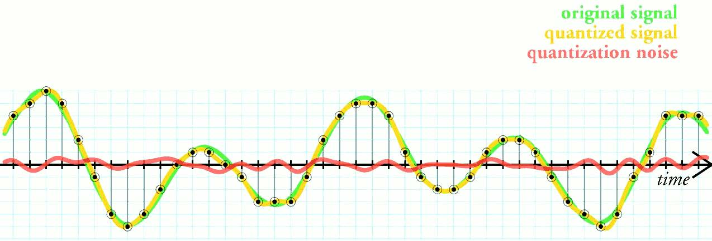

# AERO 3320 System Dynamics

Maintenance: Stephen Thiam-Choy Kwok-Choon

Email: skwokcho@calpoly.edu

Original Author: Leonardo Torres


# Lab 1 Sensor Characterization and Calibration

## 1. Objectives

<!-- justify text - <div style="text-align: justify"> your-text-here </div>     -->

<div style="text-align: justify"> Students will pick a thermistor and build hardware and software systems to take data. The students will be required to discuss sources of error, quantify errors and calibrate sensors. This lab will cover the following topics: </div>

- Sensor Types
- Interfaces
- Analog to Digital Conversion
- Quantization of Error
- Calibration
- Data Acquisition

<div style="text-align: justify"> This lab will provide experience designing, building and implementing hardware and software systems designed to take data. At the completion of this lab you should be able to calibrate analog sensors, use them to record physical properties from the world as well as identify and quantify the sources of error. </div>


## 2. Introduction

<div style="text-align: justify"> Choosing the appropriate sensor for a specific purpose requires knowledge of the characteristics of different classes of sensors and how these different classes of sensors perform in different applications and operating environments. In general, all sensors respond to a physical phenomenon by changing some characteristic of the sensor. For example, the resistance across a thermistor changes as the temperature changes. Clearly, we also must measure resistance which is also a form of a sensor. However, most analog sensors we will deal with in this class convert some physical quantity (temperature, light intensity, distance, pressure) into an electrical signal, typically voltage or resistance. We consider measuring voltage, resistance or current, as a fundamental measurement.

The course text book discusses many different sensor types based on what physical phenomenon you are attempting to measure. Many of these sensor types are beyond the scope of this class, but may be useful further along in your career.

Fundamentally, a measurement systems is comprised of a sensor, a variable conversion element, and some sort of device used to process the information known as a signal processor. Figure 1.1 in the book givens a schematic view of a measurement system. In this class, you will work with a variety of sensors, construct a variable conversion element and program a signal processor to record data. For this lab, the sensor you use will be a thermistor, the variable conversion unit will consist of a voltage divider, and the signal processor will be an Arduino micro controller. The breadboard view for this system is shown in Figure 1 [ [Fritzing.org](https://fritzing.org/) ] and the wiring schematic is shown in Figure 2. </div>

<figure>
  
  <figcaption>Figure 1. A breadboard schematic of the measurement system used in Aero 3320. Wiring Diagram created using Fritzing.  </figcaption>
</figure>

<figure>
  
  <figcaption>Figure 2. Wiring schematic of the Arduino Uno (Rev3) Platform. Wiring Diagram created using Fritzing.  </figcaption>
</figure>

### 2.1. Sensor Types

As discussed in Chapter 2, instruments (or sensors) can be described using several standard terms:

- Active and Passive
- Null-Type and Deflection-Type
- Analog and Digital
- Indicators and Instruments with Signal Output
- Smart and Nonsmart

<div style="text-align: justify"> The course textbook gives a good overview of these terms. On important concept to consider, is that almost all modern sensing systems, the instrument signal is converted into a digital signal regardless if the sensor is analog or digital. In fact, many sensors are available with a signal processor built onto the PCB. These sensors are often referred to as ‘digital’ sensors, but they are not digital with respect to how the term is defined here. When a sensor is referred to as ‘digital’ it is a reference to the type of sensor interface. Interfaces are discussed below. Interfaces are discussed below. For example, see the glossary of terms section on this discussion from Sparkfun regarding accelerometers, rate gyros and IMUs.
[ [Sparkfun Accelerometer Wiki](https://www.sparkfun.com/accel-gyro-guide) ] </div> 

### 2.2 Arduino Overview

<div style="text-align: justify"> 

“Arduino is an open-source electronics platform based on easy-to-use hardware and software. It's intended for anyone making interactive projects.” There is not much to say here about the Arduino. I suggest you go straight to the source.
 https://www.arduino.cc

Also, for some perspective, check out the Ted Talk. https://youtu.be/UoBUXOOdLXY

In general, we can use the Arduino platform to accomplish many tasks. In fact, many Autonomous Flight Vehicles use the Arduino platform as the flight computer (or auto pilot). For this portion of the lab, we are going to use the Arduino to perform the simple task of taking data. The primary component of the Arduino platform is the microcontroller. Check out the Wikipedia article on microcontrollers: https://en.wikipedia.org/wiki/Microcontroller. 

The Arduino platform we’re using includes the ATmega 328.
You can think of the microcontroller as a computer with built-in code that starts running once the power is connected to the microcontroller. All microcontrollers can be reprogrammed, but they can typically only hold one program at a time. To program a microcontroller, you write code in some other development environment (a program running on the Windows OS for example), compile the code, then port the code to a memory location on the microcontroller. The “Programming Environments” section from the Wikipedia article reference above has a bit more detail on this process.
One feature of most microcontrollers is the inclusion of an Analog-to-Digital Converter (or ADC). The Arduino platform we’re using has six ADCs.

</div> 

### 2.3 Coding in C

<!-- justify text - <div style="text-align: justify"> your-text-here </div>     -->


<div style="text-align: justify"> 
While the Arduino is about as easy as it gets for using a microcontroller, some knowledge of the C programming language is helpful. Again, the nice thing about the Arduino, is that most of the computer science stuff is taken care of for you. All you need to know is some of the basic C concepts. There are many tutorial on learning C online. Here is a link to https://www.learn-c.org/ .

Compared to Matlab, C has a different syntax, but all the same key words (for, while, if-then, etc.) for flow control. If you are comfortable with Matlab, it is pretty easy to write a simple program in C. The most significant difference between Matlab and C is that a Matlab script or function only runs in the Matlab command window environment. We generally refer to this sort of situation as the script or function being interpreted. On the other hand, C is a complied language. The code you write in C is
converted into machine language by a complier (which is just another program) and the result is an ‘executable’ program that can run in the operating system environment of your computer. Again, the computer science details are not very important to the new used.

One issue that will come up is what’s known as type conversion: https://en.wikipedia.org/wiki/Type_conversion. As discussed in Aero 3320, there are different types of variables in any programming language. We spent a lot of time discussing doubles (or double precision floating point numbers) because they are very common and Matlab considers all variables to be doubles by default. But, there are other types of variables. In the Arduino platform code below, the variable val is defined as an int for an integer using 16 bits. So here is the problem. If you divide two integers and the result is a fraction, the calculated value has to be stored as an integer. So, what happens to the fractional part? By default, the complier truncates the factional part.

For example, if type: </div>

<div style="color:black; background:lightblue; border: 1px dashed black">

``` 
int adc = 600; 
int val = 1023/adc;
``` 
</div>


<div style="text-align: justify"> The value stored in val is 1, not 1.705. How do we fix this? There are a few options which all involve converting one of the variables on the right-hand side to a float, and, we have to store val as a float. The following examples will get the desired result:
</div>

<div style="color:black; background:lightblue; border: 1px dashed black">

```
 int adc = 600; 
float val = 1023./adc; 

or 

float adc = 600; 
float val = 1023/adc;
``` 
</div>

<div style="text-align: justify"> 
Using 1023. instead of 1023 tells the complier that 1023 is a float. It then converts adc to a float and returns and stores the result as a float. Using the ‘.’ in C is not the same as the ‘.’ in Matlab. In the other example, adc is defined as a float and the compiler converts 1023 to a float and calculates and stores the result as a float. The rules of type conversion are standardized and different for different types of variables.

Why is this an issue? Balance memory and computation with performance.

There are many tools available to develop code for the Arduino. These tools are known as Integrated Development Environments (IDEs) because the handle text editing, compiling the code and exporting the executable. The Arduino IDE is available here: https://www.arduino.cc/en/Main/Software.

In the case of the Arduino, the C code you write is compiled and then ‘ported’ or transferred to the Arduino microcontroller as machine code. The code you write begins running the instant power is supplied to the Arduino.
In this class, we will use the Elegoo Uno. The Uno is a very popular version of the Arduino when a vast community of both hardware and software developers. To learn more, check out the Arduino website [ https://www.arduino.cc/en/Guide/HomePage. ]

As you go through this course, please keep in mind that the Arduino platform is by no means the ‘best’ signal processor for all applications. However, the Arduino is a very good example of the key features of a signal processing system. There are other tool developers out there see for example, National Instruments [https://www.ni.com/en.html], dSpace [https://www.dspace.com/en/inc/home/products/products.cfm?] , and Texas Instruments [ https://www.ti.com/ ]  and for many applications, custom systems are required.
 </div> 

### 2.4 Getting Data from Arduino

<div style="text-align: justify"> 
Regardless of how simple or complex you want your Arduino program to be, two function are required: <code>setup()</code> and <code>loop()</code>. The <code>setup()</code> function runs once when the Arduino first gets power. This is code you want to run once. The <code>loop()</code> function runs after the <code>setup()</code> function and, as the name suggests, runs over and over until the power to the Arduino is removed.
The code snippet below is an example of how to take an analog reading and send the reading back to the ‘serial monitor’.
</div>

<div style="color:black; background:lightblue; border: 1px dashed black">

``` 
int analogPin = 3;  // potentiometer wiper (middle terminal) 
                    // connected to analog pin 3 
                    // outside leads to ground and +5V 
int val = 0;        // variable to store the value read 
void setup() 
{ 
  Serial.begin(9600);           // setup serial 
}
  
void loop()
{
  val = analogRead(analogPin);  // read the input pin 
  Serial.println(val);          // debug value 
}
```
 </div>


<div style="text-align: justify"> 
A few general comments. The ‘//’ is how you write a comment line in C. In C, all lines of code must end with a semicolon. Notice there are two lines of code before the <code>setup()</code> function. These lines of code define two variables of type int (or integer). These variables are available to all functions in this code. The term void is the type of variable the function returns. In C we use the term void to mean nothing. In other words, the functions <code>setup()</code> and <code>loop()</code> do not return a variable.

The first two lines of code define the analog pin we are going to use to read data, and the variable we are going to use to store the analog data. In C, all variables must be defined before they can be used. In the above code, both variables are defined AND initialized. Initialization is not required but is considered good practice. These variables are accessible in all functions within the Arduino code. This
idea is known as variable scope. If a variable is defined in the function <code>setup()</code> it is not available for use in <code>loop()</code> because that variable is only in scope in the function <code>setup()</code>.

The first and only line of code in the <code>setup()</code> function establishes a serial connection between the Arduino and whatever device the USB cable is connected to. A serial connection is used to transmit data (in this case numbers and letters) from the Arduino platform to your connected device (most likely a computer). For more on serial connections see the Wikipedia article: [https://en.wikipedia.org/wiki/Serial_communication ].

Next, the <code>loop()</code> function has two lines of code. One to read the analog pin on the Arduino (<code>val = analogRead(analogPin) </code>), and one to send the value back to the device connected to the Arduino (<code>Serial.println(val)</code>).

The period in the second line of code is an example of object oriented programming. You can think of the term <code>Serial</code> as a new type of variable like a <code>double</code>. In this case however, the variable type <code>Serial</code> also has functionality. In this case the function is <code>println()</code> which actually performs the function of printing a line of text to the serial connection. This text can now be read by the connected device using the serial monitor which is part of the Arduino IDE. For a complete set of help files on the different Arduino functions and programing structures, you can look through the Arduino reference page. [ https://www.arduino.cc/en/Reference/HomePage. ]

If you type this code into the Arduino IDE or Web Editor and open the serial monitor you should see a bunch of number scrolling by. If you connect pin A3 to the GND (for ground) pin you should see a bunch of zeros scrolling by. If you connect pin A3 to the 5V pin, you should see a bunch of 1023’s scrolling by. Why is this and what if you connect the pin A3 to the 3.3V pin?
</div> 

### 2.5 Analog to Digital Conversion

An Analog to Digital Converter (ADC) is a type of signal processor that converts an analog voltage on a pin to a digital number. By converting from the analog world to the digital world, we can begin to use electronics to interface to the analog world around us.

Not every pin on a microcontroller can do analog to digital conversions. On the Arduino board, these pins have an ‘A’ in front of their label (A0 through A5) to indicate these pins can read analog voltages.

ADCs can vary greatly between microcontrollers. The ADC on the Arduino is a 10-bit ADC meaning it can detect 1,024 (or $2^{10}$) discrete analog levels. Some microcontrollers have 8-bit ADCs (or $2^{8}$) = 256 discrete levels and some have 16-bit ADCs (or $2^{16}$) = 65,536 discrete levels.

The way an ADC works is complex. There are a few different ways to achieve this feat (see Wikipedia for a list [ https://en.wikipedia.org/wiki/Analog-to-digital_converter ]) , but one of the most common technique uses the analog voltage to charge up an internal capacitor and then measure the time it takes to discharge across an internal resistor. The microcontroller monitors the number of clock cycles that pass before the capacitor is discharged. This number of cycles is the number that is returned once the ADC is complete.

#### 2.5.1 Relating ADC Value to Voltage

Referring to Figure 2, notice the ADC on the Arduino platform is measuring the voltage across the thermistor. The thermistor is part of a simple voltage divider with resistance 𝑅. A voltage divider is a
simple circuit that splits the voltage applied to two resistors proportionally. See the Wikipedia article for reference: https://en.wikipedia.org/wiki/Voltage_divider. In this case, the voltage measured by the Arduino platform is,

$$
\begin{equation}
  𝑉0=\frac {𝑅_𝑇}{𝑅_𝑇+𝑅} 𝑉_{𝑐𝑐}
\end{equation}
$$

where $𝑉_{𝑐𝑐}$ is the supply voltage to the voltage divider (3.3𝑉 or 5𝑉 on the Arduino platform).
The ADC reports a ratio-metric value. This means that the Arduino platform ADC assumes $𝑉_{𝑎𝑟𝑒𝑓}$ is the high end of the range of possible values ($2^{10}$−1=1023) and $𝑉_{𝐺𝑁𝐷}$ is the low end of the range of possible values, 0. Anything measurement, $𝑉_{0}$ less than $𝑉_{𝑐𝑐}$ or greater than $𝑉_{𝐺𝑁𝐷}$ is proportional to the ratio between 210−1=1023 and $𝑉_{𝑎𝑟𝑒𝑓}$. In this case,

$$
\begin{equation}
𝐴𝐷𝐶=\frac{1023}{𝑉𝑎𝑟𝑒𝑓} 𝑉_{0}
\end{equation}
$$

Combining Equations (1) and (2), we get,

$$
\begin{equation}
𝐴𝐷𝐶=1023 \frac {𝑅_𝑇}{𝑅_𝑇+𝑅} \frac {𝑉_{𝑐𝑐}}{𝑉_{𝑎𝑟𝑒𝑓}}
\end{equation}
$$

Notice the analog to digital conversions are dependent on the system voltage. On the Arduino platform, $𝑉_{𝑎𝑟𝑒𝑓}=5𝑉$ and $𝑉_{𝐺𝑁𝐷}=0𝑉$. If we supply the voltage divider with $𝑉_{𝑐𝑐}=𝑉_{𝑎𝑟𝑒𝑓}=5𝑉$, the ratio $\frac{𝑉_{𝑐𝑐}}{𝑉_{𝑎𝑟𝑒𝑓}}=1$ and the ADC reading equation simplifies to

$$
\begin{equation}
𝐴𝐷𝐶=1023 \frac {𝑅_𝑇}{𝑅_𝑇+𝑅}
\end{equation}
$$
On the other hand, if we use $𝑉_{𝑐𝑐}=3.3𝑉$ or $𝑉_{𝑐𝑐}=𝑉_{𝑖𝑛}$, the ADC reading would need to be scaled appropriately.


<div style="color:black; background:lightyellow; border: 1px dashed black">


Example: If you setup a voltage divider with $𝑅_{𝑇}=𝑅$ and $𝑉_{𝑐𝑐}=3.3𝑉$ what is the analog voltage measured, $𝑉_{0}$, and what is the equivalent ADC Reading?

Solution: In this case, since $𝑅_{𝑇}=𝑅$ we would expect to measure half the voltage supplied to the voltage divider based on Equation 1. Hence, 

$$
\begin{equation}
𝑉_0=\frac{𝑅_𝑇}{𝑅_𝑇+𝑅} 𝑉_{𝑐𝑐}=\frac{3.3𝑉}{2}=1.65𝑉 
\end{equation}
$$

Using Equation (3) the ADC Reading becomes:

$$
\begin{equation}

 𝐴𝐷𝐶=1023 \frac{𝑅_𝑇}{𝑅_𝑇+𝑅} \frac{𝑉_{𝑐𝑐}}{𝑉_{𝑎𝑟𝑒𝑓}} = \frac{1023}{2} \frac{3.3}{5}=337.59 

\end{equation}
$$

 In this case, we can only measure integer values so the Arduino platform reads either 337 or 338. In fact, the Arduino should read 337, 59% of the time.

 </div>


 Finally, we can use the ADC Reading to determine the resistance of the thermistor by solving Equation (4) for 𝑅𝑇.

$$
\begin{equation}
𝑅_𝑇= \frac {𝑅}{ \frac{1023}{𝐴𝐷𝐶}−1}
\end{equation}
$$

#### 2.5.2 Quantization Error


<!-- justify text - <div style="text-align: justify"> your-text-here </div>     -->

The difference between an input value and its quantized value (such as round-off error) is referred to as quantization error. A device or algorithmic function that performs quantization is called a quantizer. An analog-to-digital converter is an example of a quantizer.


<figure>
  
  <figcaption>Figure 3. An example of an original signal, quantized signal and noise.  </figcaption>
</figure>

<div style="text-align: justify"> 


The simplest way to quantize a signal is to choose the digital amplitude value closest to the original analog amplitude. This example shows the original analog signal (<code style="color : Green">green</code>), the quantized signal (black dots), the signal reconstructed from the quantized signal (<code style="color : Yellow">yellow</code>) and the difference between the original signal and the reconstructed signal ((<code style="color : Red">red</code>)). The difference between the original signal and the reconstructed signal is the quantization error and, in this simple quantization scheme, is a deterministic function of the input signal.

An ADC can be modeled as two processes: sampling and quantization. Sampling converts a voltage signal (function of time) into a discrete-time signal (sequence of real numbers). Quantization replaces each real number with an approximation from a finite set of discrete values (levels), which is necessary for storage and processing by numerical methods. Most commonly, these discrete values are represented as fixed-point words (either proportional to the waveform values or compounded) or floating-point words. Common word-lengths are 8-bit (256 levels), 16-bit (65,536 levels), 32-bit (4.3 billion levels), and so on, though any number of quantization levels is possible (not just powers of two). Quantizing a sequence of numbers produces a sequence of quantization errors which is sometimes modeled as an additive random signal called quantization noise because of its stochastic behavior. The more levels a quantizer uses, the lower is its quantization noise power.

In general, both ADC processes lose some information. As such, discrete-valued signals are only an approximation of the continuous-valued discrete-time signal, which is itself only an approximation of the original continuous-valued continuous-time signal. But both types of approximation errors can, in theory, be made arbitrarily small by good design

</div>

#### 2.5.3 Resolution

<div style="text-align: justify"> 

The resolution of the converter indicates the number of discrete values it can produce over the range of analog values. The resolution determines the magnitude of the quantization error and therefore determines the maximum possible average signal to noise ratio for an ideal ADC without the use of oversampling. The values are usually stored electronically in binary form, so the resolution is usually expressed in bits. In consequence, the number of discrete values available, or "levels", is assumed to be a power of two. For example, an ADC with a resolution of 8 bits can encode an analog input to one in 256 different levels, since $2^8=256$. The ADC values can represent the ranges from 0 to 255.

</div>

<figure>
  
  <figcaption>An 8-level ADC coding scheme, used with permission from Courtesy Spinningspark at Wikipedia, CC BY-SA 3.0, [ https://en.wikipedia.org/w/index.php?curid=27373154 ] </figcaption>
</figure>

<div style="text-align: justify">

Resolution can also be defined electrically, and expressed in volts. The minimum change in voltage required to guarantee a change in the output code level is called the least significant bit (LSB) voltage. The resolution 𝑄 of the ADC is equal to the LSB voltage. The voltage resolution of an ADC is equal to its overall voltage measurement range divided by the number of intervals: $𝑄=\frac{𝐸_(𝐹𝑆𝑅)}{2^𝑀}$

Where 𝑀 is the ADC's resolution in bits and $𝐸_{𝐹𝑆𝑅}$ is the full scale voltage range (also called 'span'). $𝐸_{𝐹𝑆𝑅}$ is given by $𝐸_{𝐹𝑆𝑅}=𝑉_{𝑅𝑒𝑓𝐻𝑖}−𝑉_{𝑅𝑒𝑓𝐿𝑜𝑤}$. Where $𝑉_{𝑅𝑒𝑓𝐻𝑖}$ and $𝑉_{𝑅𝑒𝑓𝐿𝑜𝑤are}$ the upper and lower extremes, respectively, of the voltages that can be coded. 

Normally, the number of voltage intervals is given by $𝑁= 2^𝑀$. That is, one voltage interval is assigned in between two consecutive code levels.

</div>

### 2.6 Calibration

<div style="text-align: justify">

Instrument calibration is one of the primary processes used to maintain instrument precision and accuracy. Calibration is the process of configuring an instrument to provide a result for a sample within an acceptable range. Eliminating or minimizing factors that cause inaccurate measurements is a fundamental aspect of instrumentation design.

Although the exact calibration procedure may vary from system to system, the calibration process generally involves using the instrument to test samples of one or more known values called “calibrators.” The results are used to establish a relationship between the measurement technique used by the instrument and the known values. The process “teaches” the instrument to produce results that are more accurate than those that would occur otherwise. The instrument can then provide more accurate results when samples of unknown values are tested in the normal usage of the product.

Calibrations are performed using only a few calibrators to establish the correlation at specific points within the instrument’s operating range. While it might be desirable to use many calibrators to establish the calibration relationship, or “curve”, the time and labor associated with preparing and testing many calibrators might outweigh the resulting level of performance. From a practical standpoint, a tradeoff must be made between the desired level of product performance and the effort associated with accomplishing the calibration. The instrument will provide the best performance when the intermediate points provided in the manufacturer’s performance specifications are used for calibration; the specified process essentially eliminates, or “zeroes out”, the inherent instrument error at these points

</div> 

#### 2.6.1 Temperature Measurement

The calibration process for a thermistor involves two parts, converting the measured resistance to a temperature reading, and then accounting for any systemic bias errors.
In this lab, the sensor is a negative temperature coefficient (NTC) thermistor. More precisely, we are using a MF52-103 thermistor (https://www.digikey.com/catalog/en/partgroup/mf52/10700 )

To determine the temperature of the thermistor given a resistance reading, we can use the B parameter equation which is a simplified version of the Steinhart-Hart equation. For more on these equations (and thermistors in general, see Chapter 14 of the book or this Wikipedia article https://en.wikipedia.org/wiki/Thermistor. The B parameter equation has the form,

$$
\begin{equation}
\frac{1}{𝑇}=\frac{1}{𝑇_0}+\frac{1}{𝐵} ln (\frac{𝑅}{𝑅0})
\end{equation}
$$

where $𝑇_{0}=298.15𝐾=25℃$ is the calibration room temperature, 𝐵 is the coefficient of the thermistor given by the manufacturer, 𝑅 is the measured resistance, and, 𝑅0 is the resistance of the thermistor at room temperature given by the manufacture. You will need to find values for 𝐵 and $𝑅_0$. For the MF52-103 thermistor.

#### 2.6.2 Sensitivity of Measurement

The B parameter equation approximates the physical relationship between temperature and resistance for this type of thermistor. Notice equation 5 is a non-linear function of the measured resistance. In this case, we can say the thermistor in NOT a linear sensor and the sensitivity of measurement changes as a function of the measured resistance. In general, the sensitivity of measurement is the slope (or derivative of equation 6) evaluated at the measured resistance.

#### 2.6.3 Offset

While the B parameter equation is a good place to start to convert the measured resistance to a temperature reading, we can do a better job estimating the actual temperature if we calibrate all systematic errors away.

In this case, the obvious systematic errors come from the resistor used in the voltage divider and the thermistor. All resistors are rated with a tolerance, i.e., 10𝐾Ω±5%. The MF52-103 thermistor also has a tolerance. These errors in the exact resistance of the resistors primarily come from manufacturing inconsistencies. However, if we measure the resistance of the thermistor at a known temperature we can compare the known temperature to the measured temperature. The difference in these two temperatures is the offset or systemic bias error of the measurement system. Now, all we need to do is subtract the bias error from the measurement, and we have a better measurement of the temperature near the calibration point (why?). This is known as a ‘single point’ calibration.


<div style="color:black; background:lightyellow; border: 1px dashed black">

**Example**: If the known temperature of the room is $𝑇_𝑘=25.15℃$ and the measured temperature is 𝑇=24.87℃ then the systemic bias error is $𝜖=𝑇−𝑇_{𝑘}=24.87℃−25.15℃=−0.28℃$. 

Therefore, the corrected measured temperature is $𝑇_{𝑐}=𝑇−𝜖=24.87℃−(−0.28℃)=25.15℃.$

</div>

### 2.7 Getting Data into Matlab

If you are using the Arduino IDE or web-based IDE, viewing the data streaming from the Arduino platform to your computer is a simple matter of turning on the serial monitor. But how can we save these values for analysis with Matlab?

One easy way to get data into Matlab is to use the <code> serial() </code> and <code>fopen()</code> commands. Please see the <code> serial_reader.m </code> Matlab script on the course PolyLearn page. This Matlab script will connect to the Arduino platform and gather 10 as quickly as data is available. These parameters can be changed as needed.