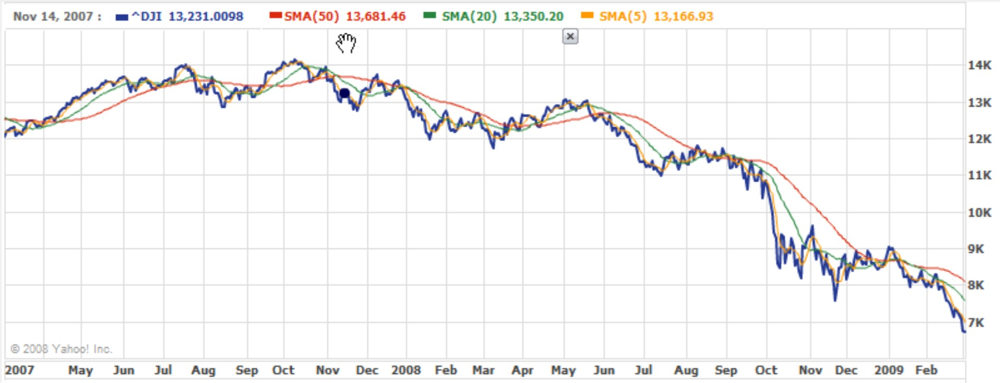

# AERO 3320 System Dynamics

Maintenance: Stephen Thiam-Choy Kwok-Choon

Email: skwokcho@calpoly.edu

Original Author: Leonardo Torres

# Lab 2: Measurement Uncertainty, Noise and Filtering

## 1 Objectives

Students will take results from the readings of a digital sensor to characterize the measurement noise and design filters to reduce the impact of systemic and random noise. This lab will cover the following topics:
- Characterize the systematic and random errors in measurement data from a digital sensor
    - Repeat parts of lab 1 as necessary
- Implement procedures to reduce systematic errors
- Implement a digital low-pass filter to reduce random errors in data
- Measure several quantities to calculate a physical quantity
    - Propagate errors in calculation

## 2 Introduction

In lab 1, we used the Arduino platform and Matlab to take data from an analog thermistor. When the temperature is relatively constant, the reading from the thermistor is also relatively constant. However, if you look closely at the data, you will see small variations in the temperature readings even though there is no real change in the actual temperature of the room. As described in chapter three of the text book, these variations are classified random errors. The fact that you had to calibrate the sensor because of the tolerance of the resistor in your voltage divider is a *systematic error*. **Please read sections 1 through 5 of Chapter 3**. The book has a good discussion on these issues. In this lab, you will look into the systematic and random errors of an ultrasonic distance sensor. 

For more on these sensors, see the following: https://en.wikipedia.org/wiki/Ultrasonic_transducer, and https://www.sparkfun.com/products/13959.

### 2.1 Digital Sensors

In this lab, you will use the HC-SR04 ultrasonic distance sensor to perform various measurements. As discussed in lab 1, in this case, digital sensor really means we have an analog sensor that is packaged as a system with other hardware and software so instead of reading an analog voltage, the digital sensor system provides an output that has already been converted to some other form. At a basic level, ultrasonic sensors send out a short burst of sound and measure the time for the burst of sound waves to bounce back to the sensor. The time for the sound burst to bounce back is proportional to the distance traveled since the speed of sound is constant over the relative small time and distance the sensor is active. For a tutorial on these sensors, and how to wire the hardware, check out the following link (be sure to declare the distance variable as a <code> float</code> instead of an <code>int</code>): http://howtomechatronics.com/tutorials/arduino/ultrasonic-sensor-hc-sr04/.

### 2.2 Characterization of the Signal Noise and Errors

As discussed in the course textbook, measurement errors can be separated into two categories, systematic, and random. In this lab, you will determine the statistical noise characteristics of the HR-SR04 to reduce the impact of the systemic errors, and then characterize the random errors.

As Chapter 4 of the course textbook discusses, we can perform basic statistical analysis on our measured data to characterize the noise present in our data. **Please read sections 1 through 11 of chapter 4 to review concepts related to statistical analysis.** 

In this lab you will characterize the nature of the data at two different sampling rates. Once the sources of errors are characterized, this information can be used to design filters like the low pass filter discussed below. Although we will not implement a Kalman filter in this lab, the Kalman filter can do a better job filtering more complex signals by using the statistical information about the data. For more on the basics of Kalman filters, see this Wikipedia article: https://en.wikipedia.org/wiki/Kalman_filter

### 2.3 Signal Processing and Filters.

The course textbook covers the basics of signal processing and passive filter design in Chapter 6, sections 1 through 7. Please read through these sections. In addition, here is a Wikipedia article on low-pass filters: https://en.wikipedia.org/wiki/Low-pass_filter.

As we discovered in Aero 300, taking the derivative of noisy data tends to amplify the noise, and taking the integral of noisy data tends to attenuate the noise. A low pass-filter is based on the idea of integrating the voltage loop equation in equation 6.16 of the textbook.

To understand how a low-pass filter works, we can start with the idea of a simple moving average (SMA). If you have ever looked at stock market data, you will sometimes see the raw data plotted with a simple moving average. The figure below is an example of some older Dow Jones Industrial Average data with three different SMA curves.

<figure>
  
  <figcaption>Figure 1. Historical Dow Jones Industrial Average data with three SMA curves.  </figcaption>
</figure>

The SMA simply calculates the average of the previous n data points and uses that average value as the current values. In Figure 1 above, the three SMA curves use averages from 50 days (red), 20 days (green) and 5 days (orange), to smooth the raw data. Notice, the fewer data points used to determine the SMA, the more closely the SMA curve follows the raw data. The rule of thumb is: the more historical data you use, the more smoothing will occur.

In the case of the SMA, all the historical data values are equally weighted in the calculation of the average. Why not weight the data values as a function of how old they are? In this case, we could argue that old data is less relevant to the current overall trend of the data. In this case, we would assign a higher weight to recent data and a lower weight to older data. If you take this idea to some sort of limit, you could weight the previous data points based on an exponentially function that decays to zero as the data gets older. Then, you would have an exponentially decaying moving average. In the limit of an infinite number of data points between now and 𝑡=0 this approach becomes the low-pass filter described in the book and the Wikipedia article. Here is a Wikipedia article that discusses moving averages (or exponential smoothing…) https://en.wikipedia.org/wiki/Exponential_smoothing.

On the other hand, the argument above is based on a continuous time set of data. In the world of digital signal processing, we need to find a discrete time approximation to the low-pass filter. We’re in luck, the approximation we need is called the complementary filter and is discussed in this Wikipedia link: https://en.wikipedia.org/wiki/Low-pass_filter#Discrete-time_realization. Notice, this derivation is based on the finite difference concept we used in Aero 300. **Read section 10 of chapter 6 for a description of the complementary filter.**

For a typical complementary filter, the value of 𝛼 is somewhat arbitrary. But, the rule of thumb is that if 𝛼 is near 1, the filter weights the new measurement more than the old data, and if 𝛼 is near zero, the filter weights the old data more than the new measurement.

From a code perspective, implementing the complementary filter requires two additional lines of code (one in the <code> setup () </code> function to ‘prime’ the filter, and one in the <code>loop()</code> function to update the filter) and some variable definitions. The code snippet below shows how to implement the complementary filter for an arbitrary analog measurement. To implement the complementary filter for the digital ultrasonic distance sensor, you will need to apply the complementary filter to the distance variable.


<div style="color:black; background:lightblue; border: 1px dashed black">

``` 
int analogPin = 3; 
    // potentiometer wiper (middle terminal) 
    // connected to analog pin 3 
    // outside leads to ground and +5V 

    // variable to store the value read 
float val = 0;          

    // alpha value for complementary filter
float alpha = .7;        

    // initialize filtered value 
float val_f = 0; 

void setup() 
{ 
    // setup serial
    Serial.begin(9600);  
    // initial filtered reading
    val_f = analogRead(analogPin);  
} 

void loop() 
{
    // read the input pin
    val = analogRead(analogPin);  

    // implement complementary filter 
    val_f = (alpha*val) + (1-alpha)*val_f   
    Serial.println(val_f);      // debug value 
}
``` 
</div>

### 2.4 Error Propagation - Calculated Quantities

Once you have good measurement data, you will likely need to use some equation based on the physics of your system to calculate some final value of interest. Chapter 4 of the course textbook gives a discussion on how to find the error of calculated quantities given the error of the measured quantities. This process is also known as Error Propagation or Propagation of Uncertainty. Error Propagation is a very important technique used in experimentation. Please read section 14 of chapter 4 for an overview of how to propagate errors of calculated values. For additional information, here is link to a Wikipedia article: https://en.wikipedia.org/wiki/Propagation_of_uncertainty

## 3 Pre-Lab Assignment

Please complete the following tasks BEFORE your assigned lab start time:
- Read sections 1 through 5 of chapter 3
- Read sections 1 through 11, and 14 of chapter 4
- Read section 1 through 7, and 10 of chapter 6
- Complete the ‘Pre-Lab 2 – Noise’ quiz module on the course canvas Page.

## 4 Lab Assignment

Complete the Lab 2 – Noise quiz on the Canvas page (10 points). The procedure and questions are given below so you can review the lab before your lab section.

### 4.1 Sensor Basics

1. (2 points) What are potential systematic measurement errors for the ultrasonic sensor?
2. (3 points) What are potential random measurement errors for the ultrasonic sensor?
3. (10 points) Set up the HC-SR04 ultrasonic sensor as described in section 2.1 of the lab manual. You will also need to write the code to measure and output the distance to the serial port. Upload the code to the Arduino platform. Also, pate your Arduino file for grading.

### 4.2 Multiple Measurements - 10 Hz

<i> Note: For this section, collect your data into Matlab and save the data as a .mat file. You can then write a script to answer parts a. through e. </i>

4. Place the ultrasonic sensor in a location to measure a fixed distance for a ten-second time span at 0.1-second intervals. Use the delay command in Arduino to implement the delay. In other words, set up something to block the ultrasonic signal somewhere on your desktop. Export the distance readings from Arduino and create a Matlab script to calculate all values below.

     <ol type="a">
        <li>(4 points) What is the mean distance measured over this time span? Does the actual distance change significantly during this time span?</li>
        <li>(4 points) What is the standard deviation of the measurements?</li>
        <li>(4 points) What is the standard error of the mean of the measurements?</li>
        <li>(3 points) Use a ruler to measure the actual fixed distance, how precise and accurate is the ultrasonic sensor?</li>
        <li>(3 points) What is the “goodness of fit” of your data to a Gaussian Distribution? Use a 𝜒2 test. This data is not great for calculating a goodness of fit value, so do not expect a low value. Also, feel free to use the <code> chi2gof() </code> Matlab function.</li>
        <li>(15 points) Upload the following:</li>
            <ol type="i">
                <li>The Matlab code used to calculate the quantities in a. through e.</li>
                <li>The distance measurements as a Matlab .mat file</li>
                <li>A plot of your raw data versus time.</li>
            </ol> 
    </ol> 

### 4.3 Multiple Measurements - 100 Hz

5. (Same points as part 4) Repeat part 4 except now measure the fixed distance 100 times per second.

### 4.4 Cleaning the Data

6. Implement a complementary filter for your ultrasonic sensor in arduino code. Initially, let $\alpha = 0.5 $ 
        <ol type="a">
                <li>(5 points) Repeat part 4.2 (10 Hz). How does the complementary filter affect your calculations?.</li>
                <li>(5 points) Take ten seconds worth of filtered and unfiltered data with 𝛼=0.5. While you are taking data, move the ultrasonic sensor away from the fixed block. Plot your filtered and unfiltered data. How does the filter effect the ‘dynamic response’ of the sensor? In this case, ‘dynamic response’ refers to the response time of the sensor; how fast does the sensor react to a change in distance?
                You can output more than one value of date to the serial port using the print() and println() commands together. In Matlab, you will need to specify that the data you are reading from the serial port has two columns. You will need to add a dimension to the data variable and change the format string of the fscanf() function.</li>
                <li>(5 points) Repeat part 6b for $/alpha ={0.1,0.3,0.5,0.7,0.9}$. Plot and upload all five filtered data sets on one set of axes. How does changing /alpha change the dynamic response of the filter?</li>
        </ol>  
7. (5 points) Using your ultrasonic sensor with the complementary filter implemented, measure the length of two sides of a rectangular object. Calculate the area of your object. Calculate the area of your object and the associated error. In other words, 𝐴+𝛿𝐴=(𝑥+𝛿𝑥)(𝑦+𝛿𝑦). You can measure (𝑥+𝛿𝑥) and (𝑦+𝛿𝑦), and then compute 𝐴+𝛿𝐴 using error propagation techniques from chapter 4 of the textbook.