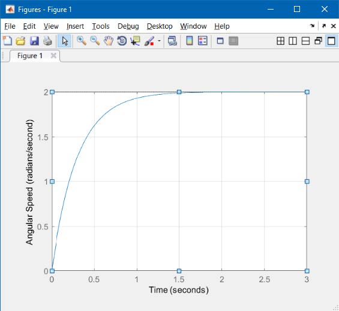
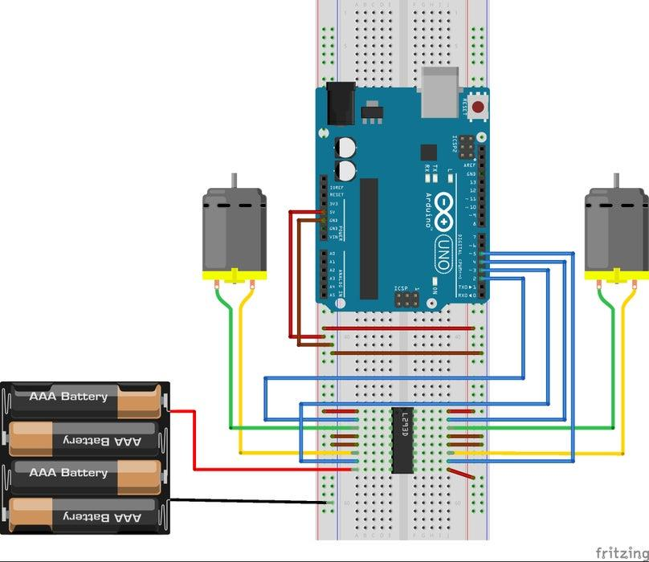
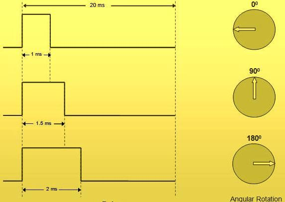
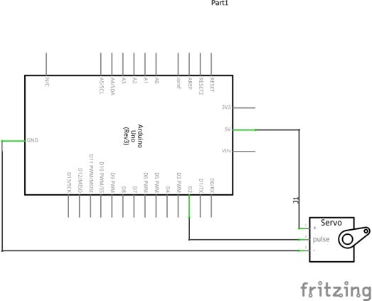
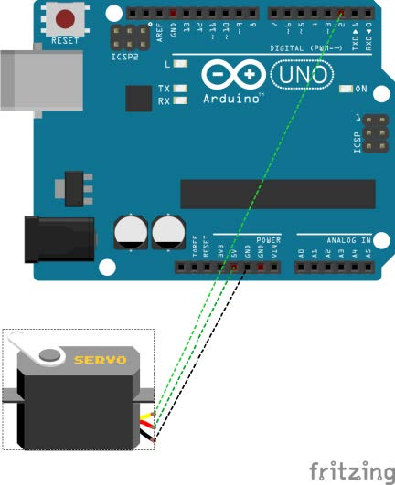
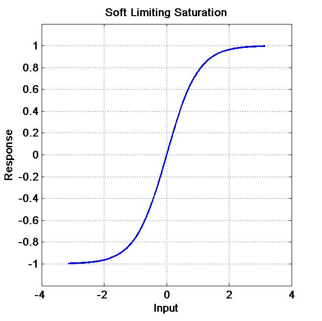
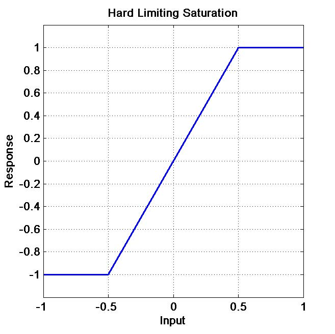

# AERO 3320 System Dynamics

Maintenance: Stephen Thiam-Choy Kwok-Choon

Email: skwokcho@calpoly.edu

Original Author: Leonardo Torres

# Lab 3 Actuator Characterization

The pre-lab assignment on Canvas is due at the beginning of this lab. The lab exercises (section 4) will be due at the end of your next lab section. Submit all materials through Canvas.

## 1. Objectives

Students will learn to connect and command servo and DC motors. These motors are covered as basic types of actuators. Other types of actuators will also be discussed. This lab will cover:
- Writing to digital ports on the Arduino Platform
- Connecting servo motors to the Arduino Platform
- Controlling a servo motor with an analog input
- Connecting DC motors to the Arduino Platform
- Using and programming a DC motor controller

Once you have developed an understanding of actuators, you will combine sensors and actuators to develop closed loop control systems.

## 2. Introduction

An actuator is a component of a machine that is responsible for moving or controlling a mechanism or system, for example by actuating (opening or closing) a valve; in simple terms, it is a "mover".

An actuator requires a control signal and a source of energy. The control signal is relatively low energy and may be electric voltage or current, pneumatic or hydraulic pressure, or even human power. The supplied main energy source may be electric current, hydraulic fluid pressure, or pneumatic pressure. When the control signal is received, the actuator responds by converting the energy into mechanical motion.

An actuator is the mechanism by which a control system acts upon an environment. The control system can be simple (a fixed mechanical or electronic system), software-based (e.g. a printer driver, robot control system), a human, or any other input

### 2.1 Types of Actuators

Obviously, there are as many types of actuators as there are types of sensors as discussed in the previous labs. As such, how you interface with and command actuators is a broad topic. For our purposes, we want to use an actuator to change the state of a system as a response to a measurement. For example, an airplane can change the pitch angle of the airplane by moving the elevator through some angle. Most aircraft use hydraulic or mechanical actuators to accomplish this elevator deflection. The pilot changes the elevator angle (to change the pitch angle) when he or she determines the pitch angle is not the desired pitch angle. Hence, the actuator response is the outcome of a measurement of some sort. This is the basic idea of control systems and is illustrated in the Figure 1 below. One way to describe this process goes:

1. A measurement of the physical state of the system is made (we did this)
2. A determination is made if the current measurement is good based on desired behavior of the system
3. If the current measurement is not “good” an actuator is used to change the state of the system subject to the physics of how the system behaves dynamically

<figure>
  
  <figcaption>Figure 1. Basic Schematic describing the relationship between actuators and sensors.  </figcaption>
</figure>

In this lab, we will focus on the basics of controlling and commanding actuators. In the next lab, we will look at putting sensors and actuators together to make the systems behave the way we want them to. First, let’s review a little bit about different types of sensors.

#### 2.1.1 Hydraulic Actuators

A hydraulic actuator consists of cylinder or fluid motor that uses hydraulic power to facilitate mechanical operation. The mechanical motion gives an output in terms of linear, rotatory or oscillatory motion. As liquids are nearly impossible to compress, a hydraulic actuator can exert a large force. The drawback of this approach is its limited acceleration.

The hydraulic cylinder consists of a hollow cylindrical tube along which a piston can slide. The term single acting is used when the fluid pressure is applied to just one side of the piston. The piston can move in only one direction, a spring being frequently used to give the piston a return stroke. The term double acting is used when pressure is applied on each side of the piston; any difference in pressure between the two sides of the piston moves the piston to one side or the other.

#### 2.1.2 Pneumatic Actuators

A pneumatic actuator converts energy formed by vacuum or compressed air at high pressure into either linear or rotary motion. Pneumatic energy is desirable for main engine controls because it can quickly respond in starting and stopping as the power source does not need to be stored in reserve for operation.

Pneumatic actuators enable considerable forces to be produced from relatively small pressure changes. These forces are often used with valves to move diaphragms to affect the flow of liquid through the valve.

#### 2.1.3 Electric Actuators
An electric actuator is powered by a motor that converts electrical energy into mechanical torque. The electrical energy is used to actuate equipment such as multi-turn valves. It is one of the cleanest and most readily available forms of actuator because it does not directly involve oil or other fossil fuels. 

#### 2.1.4 Mechanical Actuators

A mechanical actuator functions to execute movement by converting one kind of motion, such as rotary motion, into another kind, such as linear motion. An example is a rack and pinion. The operation of mechanical actuators is based on combinations of structural components, such as gears and rails, or pulleys

### 2.2 Servo and DC Motor

Since we will be using servo and DC motors in this lab, let’s spend some time looking specifically at these types of electric actuators.

#### 2.2.1 DC Motors

DC motors (or Direct Current) motors are electromagnetic device that converts electrical current into rotational motion. For a high-level overview of DC motors, read this Wikipedia article https://en.wikipedia.org/wiki/DC_motor. The circuit diagram for a DC motor is shown in Figure 2.

<figure>
  
  <figcaption>Figure 2. Circuit Diagram of a DC Motor.  </figcaption>
</figure>

In Figure 2, 𝑣 is the voltage applied to the motor, 𝑅 and 𝐿 are the resistance and inductance of the motor, 𝑒 is the back EMF of the motor coils and, 𝑖 is the current running through the motor. External to the motor, 𝜃 is the angular displacement of the motor shaft, 𝑏𝜃̇ is the friction on the motor shaft due to the fixed magnetic field, 𝑏, and 𝑇 is the torque generated by the motor and applied to the load, 𝐽.
Using Kirchhoff’s circuit law, we follow the main current loop and get,

$$
\begin{equation}
  𝑣=𝐿 \frac{di}{dt}+𝑅𝑖+𝑒
\end{equation}
$$

Using Newton’s 2nd law, we get,

$$
\begin{equation}
  𝑇=𝐽 \ddot{\theta} +𝑏\dot{\theta} 
\end{equation}
$$

Finally, from physics, the important electro-mechanical relationships are,

$$
\begin{equation}
    𝑇=k_m i ,
\end{equation}
$$
$$
  e= k_b \dot{\theta}  
$$

where $k_m$ is the motor torque constant, and $k_b$ is the electromotive force constant.

For most DC motor we can make the assumption that L is small (e.g. $ L \approx 0 $). Using this assumption, we can combine equations ( 1 ) – ( 3 ) to form the differential equation that relates motor shaft displacement to applied voltage, as,

$$
    𝑣(𝑡)=\frac{RJ}{k_m} \ddot{\theta}(t)+ (\frac{Rb}{k_m}+k_b) \dot{\theta}(t)
$$
Now, let $𝜔(𝑡)=\dot{\theta}(𝑡)$, $𝑐_1=\frac{RJ}{k_m}𝑅𝐽𝑘𝑚$, and $𝑐_2= \frac{Rb}{k_m}+𝑘_𝑏$, and we have,

$$
\begin{equation}
v(t) = c_1 + \dot{\omega}(t) + c_2 \omega(t)
\end{equation}
$$

We can now solve the differential equation in equation ( 4 ) using any standard method. Assume the motor shaft is initially at rest, $ 𝜔(0)=0 \frac{rad}{s} $ and $𝑣(𝑡)=𝑣_𝑐=𝑐𝑜𝑛𝑠𝑡$, we get a solution of,

$$
\begin{equation}
    \omega(𝑡)=  \frac{v_c}{c_2}(1-e^{\frac{c_2}{c_1} t})
\end{equation}
$$

Finally, let $𝜅=\frac{1}{c_2}$ (known as the motor gain) and $\tau=\frac{c_1}{c_2}$ (known as the motor time constant), and we have,

$$
\begin{equation}
    \omega(t)=𝜅𝑣_𝑐(1−𝑒^{\frac{t}{\tau}})
\end{equation}
$$

Upon inspection, if a constant voltage is applied, the motor must accelerate before the final speed $𝜅𝑣_𝑐$. This is due to the exponentially decaying term $𝑒^{\frac{t}{\tau}}$. An example of this acceleration is shown in Figure 3 below.


<figure>
  
  <figcaption>Figure 3. Motor Shaft Response to a 1V command.  </figcaption>
</figure>

The Motor Shaft Response to a 1V command  with $k=2 \frac{rad/s}{V}$ and $\tau = 0.3s$ is shown in figure 3. The fact that the motor cannot instantly run at $2\frac{rad}{s}$ when 1V is applied is an example of rate limiting and is discussed in the next section.

#### 2.2.2 DC Motor Speed Control

Now that we have derived the equations that relate voltage to motor speed, we can turn our attention to using the Arduino platform to command the speed of a DC motor. Since the Arduino is a digital system (and as technology has progressed) we are going to use a motor controller board which uses an H-bridge and Pulse Width Modulation (PWM) to control the direction and speed of the motor. For details on H-bridges and PWM, check out these links: https://en.wikipedia.org/wiki/H-bridge and https://en.wikipedia.org/wiki/Pulse-width_modulation.

Using PWM for motor speed control is very common. The basic idea is that the voltage across the motor is the average of the pulses over time. The pulses start at even intervals, but their width (or duration) changes. The Arduino platform has several digital outputs specifically designed to be PWM output ports.

The motor speed control you will use for this lab is the L293D chip set. For a tutorial on connecting this controller to two motors (great for wheeled robots), check out this link: https://www.instructables.com/id/Arduino-How-to-Control-DC-Motors-With-L293D-Motor-/. The breadboard diagram for hooking up the L293D is shown below in Figure 4 and is from the website list above.

<figure>
  
  <figcaption>Figure 4. The breadboard figure showing how to hook up the L293D.  </figcaption>
</figure>

For information about what the different inputs and outputs of the L293D are used for and how to set the direction and speed of each motor, check out the tutorial at the link above.

#### 2.2.3 Servo Motors

A servo motor combines a DC motor with some gearing and a method for controlling the displacement of the motor shaft. Servo motors are used extensively to control the rotational motion of a system, or, using rods and pins, the linear displacement of a system. For a general overview of servo motors, see this Wikipedia article: https://en.wikipedia.org/wiki/Servomotor.

In this lab, we will use hobby RC servo motors. While these servo motor are not a powerful or precise as larger, more expensive systems, the way they function is essentially the same. For an overview on RC servo motors, see this tutorial from Sparkfun. https://learn.sparkfun.com/tutorials/hobby-servo-tutorial?_ga=2.212353044.1489739466.1507153797-1876508606.1503948408.

There is one important difference between our servo motors and more sophisticated models; our servo motors cannot directly measure their own position. Therefore, unless we measure the displacement of the servo motor and calibrate the servo motor, we are commanding a rotation angle, but we don’t know what angle the servo motor is at. We will fix this problem in the next lab.

The Arduino code base has a servo library built-in, but in this lab, we will be using our own code to drive the servo. RC servo motors use a Pulse Width Modulation (PWM) scheme to control the rotation angle of the servo. Figure 5 shows how the PWM scheme works.


<figure>
  
  <figcaption>Figure 5. The PWM scheme used for RC servo motors.  </figcaption>
</figure>

To implement a PWM scheme for an RC servo, you write code that sends a high voltage (5V) pulse to the servo motor every 20ms. The duration (or width) of the pulse is interpreted by the servo control electronics as an angle of displacement. For most RC servos, the range of pulse widths to command the related angles is close to what is shown in Figure 5. However, this is more of a convention than a standard. Hence, it is usually necessary to determine the limits of your servo and find the relationship between pulse width and desired angular displacement. You will perform this operation as part of this lab.

The bread board and schematic view of connecting a servo to the Arduino platform are show in Figure 6 below.

<p align="center">
  
&nbsp; &nbsp; &nbsp;
  
<figcaption>Figure 6. Schematic and board view of connecting a servo to an Arduino Platform.  </figcaption>
</p>

The connection is quite simple. Connect power (<code>5V</code> and <code>GND</code>) to the red and black servo wires, and connect the servo signal wire to any digital pin on the Arduino. Now we write some Arduino code. The code snippet below commands a servo connected to digital pin 2 to rotate to somewhere close to $90^{\circ}$.

<div style="color:black; background:lightblue; border: 1px dashed black">

``` 
int servoPin = 2; // Define the digital pin number 
int pulse = 1200; // Define the pulse width in microseconds 

void setup() {
     pinMode(servoPin, OUTPUT);//Set the digital pin mode as an output pin 
     }

void loop() {
    digitalWrite(servoPin, HIGH); //Write a HIGH value to the digital pin
    delayMicroseconds(pulse);     //Wait the desired pulse time  
    digitalWrite(servoPin, LOW);  //Write a LOW value to the digital pin
    delayMicroseconds(20000); //Wait 20 milliseconds
    }
``` 
</div>

The four lines of code in the loop() function implement the PWM scheme with a constant pulse width. If we want to vary the pulse width, we would need some mechanism to provide an input into the Arduino platform. In this lab, you will use a potentiometer as a means to change the desired angle and hence, pulse width.

### 2.3 Rate and Saturation Limits

The ***rate limit*** of an actuator is the fastest speed allowable for actuator motion. The units of maximum rate must be the units of demanded actuator position per second. All physically realizable actuators have a limit to their performance. The example above for the DC motor is an example of rate limitation of an actuator. The motor cannot instantly accelerate to some new commanded speed. Based on equation ( 6 ) in this example, the smaller the value 𝜏, the faster the motor will accelerate and rate limiting will have less impact on the system.

The idea of saturation applies to both actuator and sensors. For actuators, saturation show up as a maximum effort the actuator can make. For the physical relationships for the DC motor described in equation ( 3 ) the rotational speed of a DC motor is proportional to the voltage across the motor coils. But if we apply a voltage that is too high, the motor will most likely overheat and equation ( 3 ) is no longer valid. In addition, the motor will most likely be damaged! Therefore, there is a maximum speed at which we can safely operate a DC motor. This type of saturation is known as “soft limit” saturation as shown in Figure 7.

<figure>
  
  <figcaption>Figure 7. Example of soft limit saturation  </figcaption>
</figure>

Another simple example of saturation is a control surface of an aircraft. Aircraft control surfaces have “hard limits”. In other words, the elevator of an airplane can only rotate so far before it is mechanically limited meaning the elevator is physically limited from rotating. This is known as “hard limit” saturation and an example plot is shown in Figure 8.

<figure>
  
  <figcaption>Figure 8. Example of hard limit saturation  </figcaption>
</figure>

Generally, saturation is a nonlinear response. Sometimes it is truly a hard limit (Figure 8). Other times it can be better modeled by a hyperbolic tangent (Figure 7). In either case the sensor or actuator is saturated and not providing the expected output. Saturation is something to be conscious of during the design phase. It should be included in the system model. However, proper design will usually mean that the system operates within only the linear region of a sensor or actuator.

### 2.4 Some Useful Arduino Commands

#### 2.4.1 Map()

As we have seen in several labs so far, when we take analog data we typically must convert the measured ADC value to some other physical value (voltage or resistance for example.) In this lab, we will measure the voltage (and resistance) of a potentiometer and then convert that ADC reading to a pulse width for controlling the displacement of a sensor. The <code>map()</code> function in Arduino does this task for us in only one line of code. For help on the <code>map()</code> function, follow this link: https://www.arduino.cc/en/Reference/Map.

#### 2.4.2 Serial Port Communication

Using the serial port to send data from the Arduino platform to Matlab is a relatively convenient way of gathering data for analysis. We often think of a serial port as a place through which a stream of data follows. There are many types of serial ports, but they all share this basic idea in common. Bits of data are sent along a wire electrically; high voltage is a binary 1 and low voltage is a binary 0. The job of the software is convert these streams of bits into characters (or numbers) that are readable to other
software and humans. For more on serial ports, here is a link to a Wikipedia article: https://en.wikipedia.org/wiki/Serial_port.

Most computer systems use a standard process for converting the stream of bits into characters. With eight bits, we can make 256 combinations of binary numbers and hence 256 integers. These integers are then mapped to standard characters using the Extended ASCII codes. A bit of history and the ASCII tables can be found here: https://en.wikipedia.org/wiki/ASCII and here https://en.wikipedia.org/wiki/Extended_ASCII. There are other standards for converting bit streams, but they are all based on the same concepts.

In addition to converting bits of data into characters, the software also must convert these characters to integers or floats as needed. This is called type conversion. By default, Arduino sends the data over the stream as “...human readable ASCII text followed by a carriage return character (ASCII 13, or '\r') and a newline character (ASCII 10, or '\n').” https://www.arduino.cc/en/Serial/Println. The Matlab function fscanf() we have been using then requires a format string so it can determine how to interpret the ASCII text. A full list of how to specify the format of the data is here: https://www.mathworks.com/help/matlab/ref/fscanf.html#bt_j35z-3.

Using the format specification, you can now send more than one variable from Arduino to Matlab. For example, the following Arduino and Matlab code will send two floats across the serial port.

<div style="color:black; background:lightblue; border: 1px dashed black">

``` 
ARDUINO CODE 
int servoPin = 2; // Define the digital pin number 
int pulse = 1200; // Define the pulse width in microseconds
int analogPin = 3; 
int ADCReading = 0; 

void setup() {
     Serial.begin(9600); 
     } 
     
void loop() { 
    ADCReading = analogRead(analogPin); 
    pulse = 20*ADCReading; 
    Serial.print(ADCReading); 
    Serial.print(' '); 
    Serial.println(pulse); 
    }
``` 
</div>

<p></p>

<div style="color:black; background:lightyellow; border: 1px dashed black">

``` 

MATLAB MAIN CODE 
    % all the normal serial setup code 
    % need to set the USB port and address for matlab to query
    % the main code just calls the function and requests X number of datapoint. 
    %adjacent code needs to transmit matching X data from the arduino

    %set the number of data points to pull from the serial connection.
    numDataPoints = 100;

    %save the data into an array.
    DATA = serial_reader_n(numDataPoints)

    %seperate the data into two arrays
    %make adjustments to align the data arrays transmitted from arduino
    % For example if you are transmitting three peices of information X,Y,Z from an arduino sensor. The SERIAL function and MAIN code 
    time = DATA(1,:);
    serialdata = DATA(2,:);


MATLAB SERIAL READER FUNCTION TO CALL IN MAIN CODE

function [t, data] = serial_reader_n(numDataPoints)
% Copyright 2014 The MathWorks, Inc.
% with some modificatIons by Eric Mehiel
% additional edits performed by SKC

%% Create serial object for Arduino
if (~isempty(instrfind))
    fclose(instrfind); % close all ports to start, just to be sure...
    delete(instrfind);
end

s = serial('COM3');  % change the COM Port number as needed

%% Connect the serial port to Arduino

try
    fopen(s);
catch err
    fclose(instrfind);
    delete(instrfind);
    error('Make sure you select the correct COM Port where the Arduino is connected.');
end

%% Read  the data from Arduino

i = 0; % counter
%numDataPoints = 10;
data = zeros(numDataPoints,1);
t = zeros(numDataPoints,1);

tempData = fscanf(s); % Clear the serial buffer

timer = tic; % Start timer
while i < numDataPoints
    i = i + 1;
    % Read buffer data
    disp('Reading Serial Data');
    data(i,1) = fscanf(s, '%f')'; % Change format string as needed
    % Read time stamp
    t(i) = toc(timer);
end
fclose(s);
delete(s);
clear s;
``` 
</div>