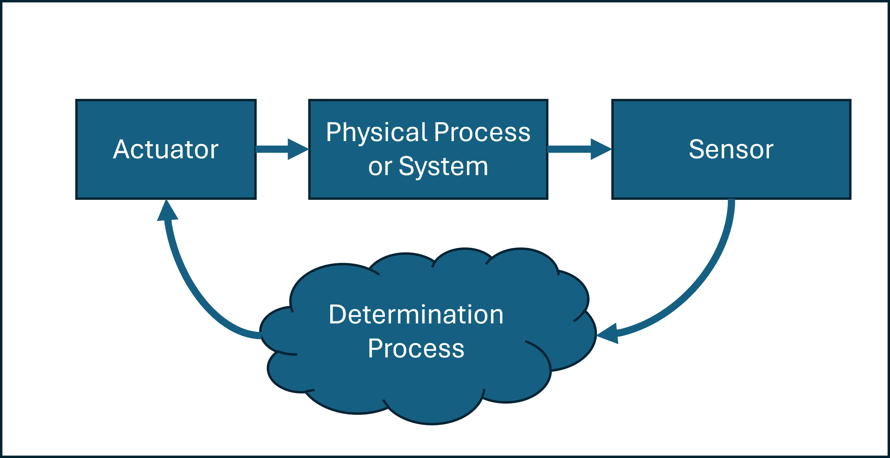

# AERO 3320 System Dynamics

Maintenance: Stephen Thiam-Choy Kwok-Choon

Email: skwokcho@calpoly.edu

Original Author: Leonardo Torres

# Lab 3 Actuator Characterization

The pre-lab assignment on Canvas is due at the beginning of this lab. The lab exercises (section 4) will be due at the end of your next lab section. Submit all materials through Canvas.

## 1. Objectives

Students will learn to connect and command servo and DC motors. These motors are covered as basic types of actuators. Other types of actuators will also be discussed. This lab will cover:
- Writing to digital ports on the Arduino Platform
- Connecting servo motors to the Arduino Platform
- Controlling a servo motor with an analog input
- Connecting DC motors to the Arduino Platform
- Using and programming a DC motor controller

Once you have developed an understanding of actuators, you will combine sensors and actuators to develop closed loop control systems.

## 2. Introduction

An actuator is a component of a machine that is responsible for moving or controlling a mechanism or system, for example by actuating (opening or closing) a valve; in simple terms, it is a "mover".

An actuator requires a control signal and a source of energy. The control signal is relatively low energy and may be electric voltage or current, pneumatic or hydraulic pressure, or even human power. The supplied main energy source may be electric current, hydraulic fluid pressure, or pneumatic pressure. When the control signal is received, the actuator responds by converting the energy into mechanical motion.

An actuator is the mechanism by which a control system acts upon an environment. The control system can be simple (a fixed mechanical or electronic system), software-based (e.g. a printer driver, robot control system), a human, or any other input

### 2.1 Types of Actuators

Obviously, there are as many types of actuators as there are types of sensors as discussed in the previous labs. As such, how you interface with and command actuators is a broad topic. For our purposes, we want to use an actuator to change the state of a system as a response to a measurement. For example, an airplane can change the pitch angle of the airplane by moving the elevator through some angle. Most aircraft use hydraulic or mechanical actuators to accomplish this elevator deflection. The pilot changes the elevator angle (to change the pitch angle) when he or she determines the pitch angle is not the desired pitch angle. Hence, the actuator response is the outcome of a measurement of some sort. This is the basic idea of control systems and is illustrated in the Figure 1 below. One way to describe this process goes:

1. A measurement of the physical state of the system is made (we did this)
2. A determination is made if the current measurement is good based on desired behavior of the system
3. If the current measurement is not “good” an actuator is used to change the state of the system subject to the physics of how the system behaves dynamically

<figure>
  
  <figcaption>Figure 1. Basic Schematic describing the relationship between actuators and sensors.  </figcaption>
</figure>

In this lab, we will focus on the basics of controlling and commanding actuators. In the next lab, we will look at putting sensors and actuators together to make the systems behave the way we want them to. First, let’s review a little bit about different types of sensors.

#### 2.1.1 Hydraulic Actuators

A hydraulic actuator consists of cylinder or fluid motor that uses hydraulic power to facilitate mechanical operation. The mechanical motion gives an output in terms of linear, rotatory or oscillatory motion. As liquids are nearly impossible to compress, a hydraulic actuator can exert a large force. The drawback of this approach is its limited acceleration.

The hydraulic cylinder consists of a hollow cylindrical tube along which a piston can slide. The term single acting is used when the fluid pressure is applied to just one side of the piston. The piston can move in only one direction, a spring being frequently used to give the piston a return stroke. The term double acting is used when pressure is applied on each side of the piston; any difference in pressure between the two sides of the piston moves the piston to one side or the other.

#### 2.1.2 Pneumatic Actuators

A pneumatic actuator converts energy formed by vacuum or compressed air at high pressure into either linear or rotary motion. Pneumatic energy is desirable for main engine controls because it can quickly respond in starting and stopping as the power source does not need to be stored in reserve for operation.

Pneumatic actuators enable considerable forces to be produced from relatively small pressure changes. These forces are often used with valves to move diaphragms to affect the flow of liquid through the valve.

#### 2.1.3 Electric Actuators
An electric actuator is powered by a motor that converts electrical energy into mechanical torque. The electrical energy is used to actuate equipment such as multi-turn valves. It is one of the cleanest and most readily available forms of actuator because it does not directly involve oil or other fossil fuels. 

#### 2.1.4 Mechanical Actuators

A mechanical actuator functions to execute movement by converting one kind of motion, such as rotary motion, into another kind, such as linear motion. An example is a rack and pinion. The operation of mechanical actuators is based on combinations of structural components, such as gears and rails, or pulleys

### 2.2 Servo and DC Motor

Since we will be using servo and DC motors in this lab, let’s spend some time looking specifically at these types of electric actuators.

#### 2.2.1 DC Motors

DC motors (or Direct Current) motors are electromagnetic device that converts electrical current into rotational motion. For a high-level overview of DC motors, read this Wikipedia article https://en.wikipedia.org/wiki/DC_motor. The circuit diagram for a DC motor is shown in Figure 2.

<figure>
  
  <figcaption>Figure 2. Circuit Diagram of a DC Motor.  </figcaption>
</figure>