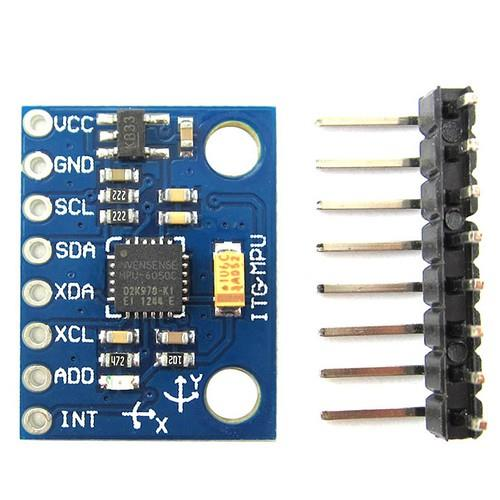
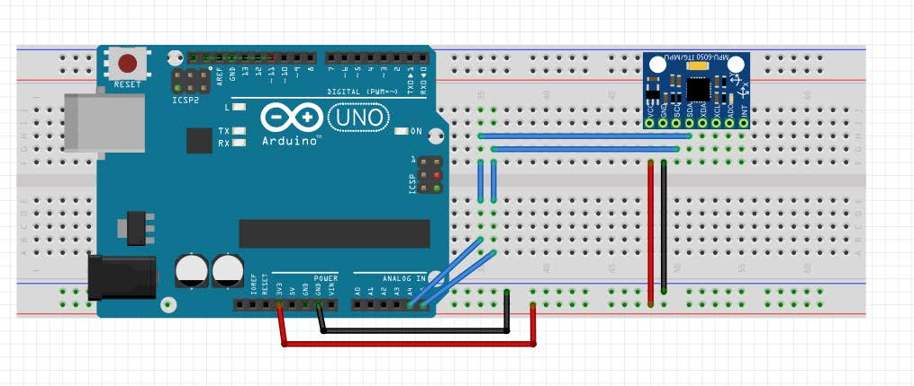

# AERO 3320 System Dynamics
Maintenance: Stephen Thiam-Choy Kwok-Choon

Email: skwokcho@calpoly.edu

Original Author: Leonardo Torres

# Lab 4: Regulation and Arduino Libraries

**Closed Loop Control**

## 1. Objectives

Students will learn to connect and gather data from an accelerometer using a library. Students will use the accelerometer data to measure the roll angle of the accelerometer and regulate the armature position of a servo motor. This lab will cover:

- Importing and using an Arduino library
- The basics of object oriented programming
- Calculating the roll angle from an accelerometer reading of the gravity vector
- Regulating the armature position of a servo motor using proportional feedback

## 2. Introduction

There are several more advanced coding concepts we will cover with this lab. These more advanced concepts include:

- Code refactoring: https://en.wikipedia.org/wiki/Code_refactoring

- Importing and using Arduino libraries: https://www.arduino.cc/en/Reference/Libraries

- Class definitions and objects: http://www.geeksforgeeks.org/c-classes-and-objects/


Each of the above links goes into some detail that might not have significance for you now. Read the rest of the lab manual and then head back to those links for further insight. Let’s start with code refactoring

### 2.1. Code Refactoring

In lab 3, you wrote separate functions outside the setup() and loo() functions which you then called from the loop() function. The basic idea was to take a chunk of code you used in the loop() function and then move it to some other function defined outside the loop() function. You can then call the new function from the loop() function. The code below is an example of this concept for the servo.

<div style="color:black; background:lightblue; border: 1px dashed black">

``` 
// ORIGINAL SERVO MOVE CODE 
int servoPin = 2; // Define the digital pin number 
int pulse = 1200; // Define the pulse width in microseconds 

void setup() { 
    //Set digital pin mode as an output pin 
    pinMode(servoPin, OUTPUT);
    
} 
    
void loop() { 
    digitalWrite(servoPin, HIGH); //Write a HIGH value to digital
    pin delayMicroseconds(pulse); //Wait desired pulse time
    digitalWrite(servoPin, LOW); //Write a LOW value to digital
    pin delayMicroseconds(20000); //Wait 20 milliseconds 
}
``` 
</div>


<div style="color:black; background:lightblue; border: 1px dashed black">

``` 
// REFACTORED SERVO MOVE CODE 

int servoPin = 2; // Define the digital pin number 

void setup() {
    pinMode(servoPin, OUTPUT);//Set digital pin mode as an output pin 
} 

void loop() {
    // Define the pulse width in microseconds
    int pulse = 1200; 
    servoMove(pulse); 
} 

void servoMove(int pulseLength) {
    //Write a HIGH value to digital pin
    digitalWrite(servoPin, HIGH);

    //Wait desired pulse time
    delayMicroseconds(pulseLength);
    
    //Write a LOW value to digital
    digitalWrite(servoPin, LOW);  
    
     //Wait 20 milliseconds
    pin delayMicroseconds(20000); 
}
``` 
</div>

There are a few things to notice. First, and most obvious change is the addition of the function servoMove(). Remember, a function definition includes a return type, followed by the function name, and then a list of input type and input name pairs separated by commas. In general,

<code>returnType functionName(inputType1 inputName1, inputType2 inputName2, …). </code>

In the code above, the return type is <code>void</code> meaning no variable is returned and the function name is <code>servoMove</code>. There is only one input of type <code>int</code> and the input name is <code>pulseLength</code>. It is important to
remember that the variable <code>pulseLength</code> is now a local variable and is only defined in the function <code>servoMove</code>.
The second change to the code is now the loop defines the variable <code>pulse</code> and then calls the function <code> servoMove </code> instead of the four lines of code used to move the servo. If you were to follow the execution of this code line-by-line, you would see the lines of code are executed in the exact same order for both sets of code. So why bother refactoring?

The most obvious reason is compartmentalization. Imagine a scenario where you needed to make move the servo several times in different ways each time through the loop. Look at the example code below. Notice less code is needed and the loop function is very clear compared to if all the commands to move the servo were in the <code>loop()</code> function.


<div style="color:black; background:lightblue; border: 1px dashed black">

``` 
// BENEFITS OF REFACTORING 

// Define the digital pin number 
int servoPin = 2; 

void setup() { 
    //Set digital pin mode as an output pin 
    pinMode(servoPin, OUTPUT);
} 

void loop() { 
    servoMove(1200); 
    delay(100); 
    servoMove(1800); 
    delay(100); 
    servoMove(600); 
} 

void servoMove(int pulseLength) {
    //Write a HIGH value to digital pin
    digitalWrite(servoPin, HIGH);

    //Wait desired pulse time
    delayMicroseconds(pulseLength);

    //Write a LOW value to digital
    digitalWrite(servoPin, LOW); 

    //Wait 20 milliseconds 
    pin delayMicroseconds(20000); 
}
``` 
</div>


Another reason compartmentalizing your code is useful is because we can test the functionality of the <code>servoMove</code> function independently from the <code>loop()</code> function. This idea is known as unit testing. 

Once we know the <code>servoMove</code> function is fully tested and works, we can store it away and use it any time we want in the future. This leads to the concept of libraries.

### 2.2 Importing and Using Arduino Libraries

The idea of an Arduino library is simple once we appreciate the value of refactoring code. Let’s say you wrote a whole bunch of extra function that allow you to do all sorts of things with a specific sensor or actuator. You have all these functions included in some Arduino code and your code works great for your current setup. But now, you want to use the same sensor or actuator in a different set up, but you keep all the functionality you created in your refactored code. What if there was a way to save all this code in some other place and then simply import the code into your new Arduino sketch? We there is. It’s known as a library!

In fact, you have already been using a library. Every Arduino sketch includes the Arduino library be default. All the commands you have been using for serial communication are in the Arduino library. But what if you want to include a different library? Either one included with the Arduino language, or the custom library you wrote for your sensor? The way you include some other set of code (or library) is to use the #include command.

For example, Arduino actually includes a library designed to run servo motors. Please don’t be mad… The code below is an example of using the Arduino servo library.


<div style="color:black; background:lightblue; border: 1px dashed black">

``` 
#include <Servo.h> 

// create servo object to control a servo 
Servo myservo; 

// analog pin used to connect the potentiometer
int potpin = 0;  

// variable to read the value from the analog pin
int val;  

void setup() {
    // attaches servo on pin 9 to the servo object 
    myservo.attach(9); 
} 

void loop() {
    
    // reads value of the potentiometer
    val = analogRead(potpin);  
    
    // scale to use with the servo
    val = map(val, 0, 1023, 0, 180);  
    
    // sets the servo position    
    myservo.write(val);  
    
    // waits for the servo to get there
    delay(15);
}
``` 
</div>

The code above does the same thing you did in Lab 3, only it uses the built-in Arduino servo library instead of your custom code. If you want to see the actual code, check out this link to GitHub https://github.com/arduino-libraries/Servo. 

This is the awesome part about open-source projects; you can have access to all the code! There is one short coming to the Arduino Servo library compared to the code you wrote. Notice, nowhere in the code can you set the parameter for microseconds/degree for the servo. And since we saw all servos are different, this could be a problem. The Arduino Servo library does allow you to set this parameter, but it take a bit more work. But fundamentally, if we can simply import a well-documented and tested library, that is usually better than us reinventing the wheel.

The built in libraries are great, and there are thousands of other libraries out there developed by other people and companies. But what about your custom library? To use your custom library, you can either import the library from the Arduino IDE Sketch->Include Library menu and pick your library. Or you can use the <code>#include</code> directive, for example, <code>#include “myCustomLibrary.h” </code>.

However, before you can refactor your code into a custom library, you first need to understand a bit about Object Oriented programming techniques.

### 2.3 Class Definitions and Objects

So far (in Arduino and Matlab) when you declare a variable, you have been using built in variable types, e.g., int, float, double, etc. But what if you could create your own variable type? This is the basic idea of object oriented programming https://en.wikipedia.org/wiki/Object-oriented_programming. There are many examples out there, but one simple one I like is the example of a cat variable.

We could imagine a variable named cat. Then we could imagine what kinds of values the cat variable would store. Say color and age. These are known as properties of the cat. The cool thing about object oriented programming is that the new variable type can also include functionality. For example, cats can speak (they saw “meow”.)

The term class refers to the definition of all the properties and functionality of a new variable type. The term object refers to actual variable in your code that is of the new variable type. We then use the “.” To get access to all the properties and functions we have defined for the new variable type. Notice, you have already been using Object Oriented Programming techniques when you used the commands <code>Serial.begin(9600)</code> and <code>Serial.print(“”)</code> and <code>Serial.println(“”)</code>. <code>Serial</code> is the object and <code>begin()</code>, <code>print()</code>, and <code>println()</code> are all functions of the print object.

Considering the cat example above, if you defined a <code>cat</code> class, you could then use the property names, color and age like, <code>cat.color</code> and <code>cat.age</code>. You would access the speak function like <code>cat.speak()</code>. Notice a <code>speak()</code> function call on the cat object has to include the open and closed parenthesis. To access the properties of the cat (color and age) you do not include the open and close parenthesis.

For a tutorial on how to create your own library, check out this link to the Arduino website: https://www.arduino.cc/en/Hacking/LibraryTutorial. In this lab you are going to write your own basic Servo library and use a simplified library used to interface with an accelerometer.

#### 2.3.1 Basic Class Definition 

As explained in the tutorial, there are a few key elements required for a class definition in Arduino. They are:

- A .h file that defines all the properties and function of the class including the constructor
- A .cpp file that defines the functionality of all the functions defined in the class definition
- At least one constructor that tells your code how to build an object from your class definition

Finally, in a class definition, properties and functions can be either public or private. Public properties and functions are available to everyone and private properties and functions are only available to the functions defined in the class. See the tutorial above for an example.

The last practical consideration is how to develop your code. In general, the Arduino IDE is not well setup to develop libraries and classes. If you want to work on developing more libraries and classes, I recommend using Eclipse or Visual Studio. However, for this lab, we can use any simple text editor. You will be provided outlines for the servo library you are going to create.

The code below is the basic outline of a class including both .h and .cpp files.

myClass.h

<div style="color:black; background:lightblue; border: 1px dashed black">

``` 
// myClass.h 

#include "arduino.h" 

class myClass 
    { 
    public: 
        // This is the constructor and can have inputs
        myClass();

        //example function  
        void function1(int input);  
        
        //any other public properties or functions
        
    private: 
        int variable1; 
        //any other private properties or functions 
    };
``` 
</div>

myClass.cpp


<div style="color:black; background:lightblue; border: 1px dashed black">

``` 
// myClass.cpp 
#include "myClass.h" 

myClass::myClass() 
{
     // Define and variables here 
     // Set anything the class must do initially here 
     variable1 = 4; 
} 

void myClass::function1(int input) 
{ 
    Variable1 = input; 
}
``` 
</div>

Once both files are placed in a folder with the class name in the “libraries” folder within the Arduino folder, the Arduino IDE will now regocnize the library and you can now use the library by adding the line, “include “<code>myClass.h</code>”” to your code.

#### 2.3.2 Using a Class

Once you have a class defined you can use the new custom variable type by creating a variable of that type in code. The code snippet below is an example using the myClass library.

<div style="color:black; background:lightblue; border: 1px dashed black">

``` 
// myClass.cpp 
#include <myClass.h>

myClass x = myClass(); 

void setup() {

} 
 
void loop() { 
    x.function1(1000); 
}
``` 
</div>

This example code doesn’t do much, but it is important to notice that when you declare the variable x, you define it by calling the constructor function. Then, once you have the variable of type myClass in your code, you use the “.” to call the functions defined by the class.

### 2.4 Use an Accelerometer to Find the Roll Angle

In this lab you will use a simple library developed to get data from an GY-521 accelerometer. Note the GY-521 also includes a rate gyro making useful as a full IMU. Again, you can find many examples and data sheets for this model of accelerometer. The GY-521 was developed for use in cell phones, but it has found many uses in the autonomous flight vehicle world.

As discussed in Aero 320, the roll angle is a Euler rotation angle about the x-axis of a rigid body. In this case, the accelerometer is the rigid body and in fact, if you look closely at the breakout board, you will see a small set of axes printed on the board. The GY-521 is a MEMS type accelerometer. For more on these sensors, check out this Wikipedia link: https://en.wikipedia.org/wiki/Accelerometer


<figure> <p align="center">
  
  <figcaption>Figure 1. GY-521 Accelerometer  </figcaption>
  </p>
</figure>

Connecting the GY-521 to the Arduino platform is very straight forward. The breadboard diagram is shown in Figure 2 which is from a project post on the Arduino website https://create.arduino.cc/projecthub/Nicholas_N/how-to-use-the-accelerometer-gyroscope-gy-521-6dfc19. 

The GY-521 break-out board uses an I2C serial communication bus. The transmit and receive channels are connected to the dedicated SCL and SCA pins on the Arduino. For more on I2C, check out this link: https://en.wikipedia.org/wiki/I%C2%B2C.

<figure> <p align="center">
  
  <figcaption>Figure 2. GY-521 Accelerometer  </figcaption>
  </p>
</figure>

To find the roll angle of the accelerometer using the gravity vector, we refer to Figure 3 below. The figure is from a report at http://iopscience.iop.org/article/10.1088/0957-0233/26/12/125102.

<figure> <p align="center">
  
  <figcaption>Figure 3. Orientation of Accel and Interial Frames  </figcaption>
  </p>
</figure>

In our case, the gravity vector points in the $- \overrightarrow{z}-axis$. Noting that $\theta$ is the roll angle, we can deduce,

$$
\begin{equation}
  \theta = atan(g_y / {\sqrt{g^2_x+g^2_z}})
\end{equation}
$$

It is worth noting we can easily find the pitch angle, but it is a bit more difficult to find the yaw angle…

Finally, when you start up the accelerometer, you will need to calibrate the accelerometer based on how the chip is mounted on the breakout board and any other offsets. To do this, you can take several measurements and average the raw measurements and subtract the average from each axis. 

In other words, the accelerometer should read 0 in the x-axis, 0 in the y-axis and 16384 in the z-axis when you lay the accelerometer flat on a table (assuming the table is level!).

### 2.5 The Regulation Problem

In classical control theory, we typically break control goals into two broad areas, tracking and regulation. Tracking is generally thought of trying to get the system to track a time varying input. For example, if the desired altitude of aircraft is changing due to pilot inputs, the plane will try to track the desired altitude. The regulation problem is generally thought of as trying to get the system to stay in a constant state. For example, if the desired altitude is constant, but due to changes in windspeed the lift on the wing changes, a regulator would try to vary the thrust to maintain a constant altitude.

In this lab you are going to use an accelerometer to get the servo motor arm to maintain a constant orientation relative to the inertial reference frame. A simple block diagram of your system is shown below in Figure 4.

<figure> <p align="center">
  
  <figcaption>Figure 4. A simple regulation system  </figcaption>
  </p>
</figure>

In this case, the measured angle is subtracted from the desired angle to generate an error in the roll angle. Multiplying this error by a constant (and adding an offset) converts the error into a desired pulse width command to the servo. If this measure and command process is repeated over and over in the <code>loop()</code> function of the Arduino, the servo motor arm should maintain a fixed orientation (roll only) in the inertial frame.

## 3. Pre-Lab Assignment

Please complete the following tasks BEFORE your assigned lab start time:
- Complete the ‘Pre-Lab 4 – Regulation quiz module on the course Canvas Page.

## 4. Lab Assignment

### 4.1 Servo Motor Library

1. (35 points) Write and upload a Servo library named myServo with the following requirements:

    a. The constructor takes the following inputs:

        i. int servoPin – the digital pin the servo is connected to
        ii. float mSecPerDegree – the value of milliseconds per degree for this servo
        iii. int zeroPulseWidth – the pulse width that corresponds to a servo angular deflection of zero degrees
        iv. Each of the inputs are also private properties of the myServo class
    b. A public function with no return called write() that has one input of type float called degrees. This function should command the servo to the angle degrees using the private properties defined in part 1.a.
2. (15 points) Write and upload Arduino code that includes your myServo library. Test the code to make sure it works.

### 4.2 Regulation of a Servo Motor

3. (10 points) Write a function you can call from the setup() function to calibrate the accelerometer. Test and upload the code.

4. (40 points) Using the myServo and wire.h libraries, write Arduino code that regulates the roll angle of the servo arm to zero degrees relative to the inertial frame.